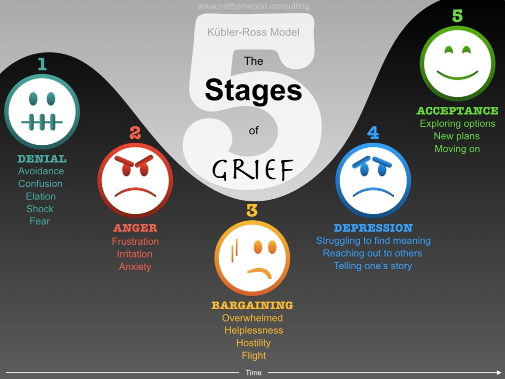
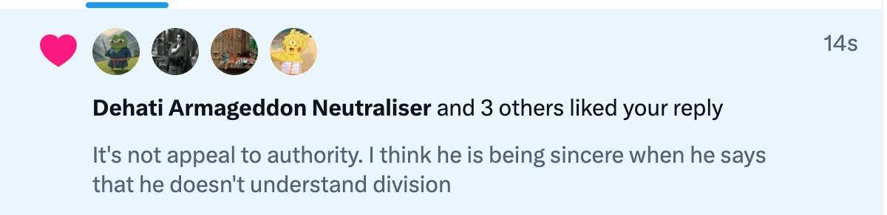

<!-- MathJax for rendering inline/block LaTeX -->

# The Pāṇini Protocol: The Complete Saga from Challenge to Block

This is the full account of the Pāṇini Protocol: a scholarly encounter that began in good faith, passed the fire of public challenge, and ended in evasive silence. It is a case study in how a **publicity-driven claim**, never meant to withstand academic scrutiny, folds when it meets formal critique.

## Prologue: "Perhaps This Is All A Misunderstanding"
***December 2024 - February 2025***

Early reactions to Yajnadevam’s claims were cautious, even generous. What he prsented as "Sanskrit" showed clear grammatical faults—but many assumed the information theoretic basis was sound.

We reached out in good faith:

<blockquote class="twitter-tweet">
Sir, while your methods indeed seem mathematically sound and fascinating, it&#39;s still true that the end result doesn&#39;t sound Sanskrit. It lacks many features essential to any stage of Indo Aryan
&mdash; उ॒ग्रश्र॑वस् (@Ugrashravas) <a href="https://twitter.com/Ugrashravas/status/1873741227209941501?ref_src=twsrc%5Etfw">December 30, 2024</a></blockquote>  

 

Despite the long discussions in these threads [[1]](https://x.com/Ugrashravas/status/1874494292301131909), [[2]](https://x.com/Ugrashravas/status/1875129521202229617) (which were met with increasingly dismissive replies) we continued the conversation in private. There, we pointed out several key issues: the language lacked a consistent case system and verbal conjugation, phoneme frequencies resembled *no* form of Sanskrit ([as later rigorously shown](https://x.com/khoomeik/status/1882058141145403817) by [@khoomeik](https://x.com/khoomeik)), and the translations lacked grammar.

Upon reviewing his method, we found his "dictionary" turned out to be just a [list of stems—not actual words](methodology-flaws.md#the-dictionary-used-contains-exclusively-gibberish). We urged him to try using a real one.

To summarize, our core claim was:
1. Yajnadevam's outputs aren’t Sanskrit—they violate basic grammar
2. His method is so unconstrained that *anything* can be force-fitted as ungrammatical "Sanskrit"

To the first point, he replied ["You don't know what the Harappans wrote"](https://x.com/yajnadevam/status/1874454050026230135). This dodges the issue. If the result is claimed to be Sanskrit, it must follow Sanskrit grammar—not hypothetical Harappan usage.

To the second<!-- ([which others had also pointed out](https://x.com/SebastianNehrd2/status/1897554610510029200)) -->, he replied with a dismissive challenge: ["Decipher the US Constitution as Sanskrit"](https://x.com/yajnadevam/status/1893915880121069864). This was likely meant to shut us up.

Instead, we took it seriously.

### The Seeds of the Pāṇini Protocol
***07 July 2025***

We applied his method (including his own phoneme classing, ungrammatical constructs, and reliance on unicity distance) to the U.S. Constitution. We used the key revealed to us by Thomas Jefferson in a dream to decode and translate the United States Constitution well past the unicity dsitance he set [at the time](unicity-history.md):

<blockquote class="twitter-tweet">
Presenting the world&#39;s first decipherment of the United States Constitution as Pāṇinian Sanskrit  *Bhagavati Viśvasimaḥ*  1/n <a href="https://t.co/CQL6tGtelE">pic.twitter.com/CQL6tGtelE</a>
&mdash; उ॒ग्रश्र॑वस् (@Ugrashravas) <a href="https://twitter.com/Ugrashravas/status/1942250809645051909?ref_src=twsrc%5Etfw">July 7, 2025</a></blockquote>  

 

The results looked exactly like his: ungrammatical Sanskrit, vague stems, and a total absence of structure. In other words, it worked.

Thus began the **Pāṇini Protocol**: which would soon become a full-scale demonstration that any text, when tortured through his method, can yield "Sanskrit" that’s just as ungrammatical as his original. What follows is a surprisingly textbook progression through all [five stages of grief](https://en.wikipedia.org/wiki/Five_stages_of_grief), triggered by [Jefferson's Key](index.md#our-solution-to-the-challenge-jeffersons-key) working too well.

 

## Chapter 1: Denial
***08-14 July 2025***
### 1.1 Initial Skepticism and Bewilderment
***08 July 2025***

The initial reaction from Yajnadevam and his supporters was one of confusion and disbelief, a kind of collective bewilderment. For reasons still unclear, they were unable to process the fact that a dhoti-clad Pikachu had received a magic phoneme key from Thomas Jefferson in a dream and then used it to decipher the U.S. Constitution.

This produced some charming moments where a few in the audience simply forgot to scroll:

<blockquote class="twitter-tweet">
<a href="https://twitter.com/yajnadevam?ref_src=twsrc%5Etfw">@yajnadevam</a> gave a map for each symbol in IVC script to Devanagari. Where is that map from Roman 26 to 52 symbols from which the text can be deciphered ? Obviously that’s the key work not done. <a href="https://t.co/00zyat1dLL">https://t.co/00zyat1dLL</a>
&mdash; INY (@inynor36) <a href="https://twitter.com/inynor36/status/1942477689530839047?ref_src=twsrc%5Etfw">July 8, 2025</a></blockquote>  

 

While others remained in incredulity, firmly believing that the key’s success was a fluke:

<blockquote class="twitter-tweet">
Reverse translate the Jefferson papers  They&#39;re from the same era. Let&#39;s see if you can preserve your junk assignment.  You should be able to read it with your assignment from the Constitution <a href="https://t.co/YvoY3qiSbG">https://t.co/YvoY3qiSbG</a>
&mdash; Nana Siddharth (@NanaSiddharth) <a href="https://twitter.com/NanaSiddharth/status/1942551064793997600?ref_src=twsrc%5Etfw">July 8, 2025</a></blockquote> 

 

To quell [such doubts](https://x.com/NanaSiddharth/status/1942550539075739675) about the efficiacy of Jefferson's Key, we used it to produce translations not only of [the critic's own tweet](https://x.com/Ugrashravas/status/1942565655590625370), but also of Twitter brainrot:

<blockquote class="twitter-tweet">
Turns out to be a Dravidian spy for the Aryans concerned that the Aryans didn&#39;t show up at dawn to invade his IVC fort <a href="https://t.co/z3mNR9Ujow">pic.twitter.com/z3mNR9Ujow</a>
&mdash; उ॒ग्रश्र॑वस् (@Ugrashravas) <a href="https://twitter.com/Ugrashravas/status/1942632943312146555?ref_src=twsrc%5Etfw">July 8, 2025</a></blockquote>  

 

### 1.2 Early Foreshadowing
***08 July 2025***

Yajnadevam himself, was apparently [on vacation](https://x.com/yajnadevam/status/1942969902287175990) and had [not read my decipherment yet](https://x.com/yajnadevam/status/1942958381238796782). Nevertheless, he quickly surfaced to confidently announce that my unicity distance was wrong:

<blockquote class="twitter-tweet">
Your unicity distance is incorrect… first of all, you neglect the fact that most of these text is in lower case and your brahmi mapping also works only for upper case. Secondly you are mapping LL to A which means your cipher is no longer just homophonic. Needs recomputation.
&mdash; yajnadevam (@yajnadevam) <a href="https://twitter.com/yajnadevam/status/1942601168427126867?ref_src=twsrc%5Etfw">July 8, 2025</a></blockquote>  

 

The lowercase complaint was a complete red herring. The ciphertext under consideration was [entirely uppercase](https://x.com/Ugrashravas/status/1942603213213163534) to begin with (in scriptio continua too, like the Indus seals), making the objection moot. The "LL to A" point was (apart from being flatly false) equally hollow, given his own decipherment tolerates far [sloppier symbol clustering](https://x.com/Ugrashravas/status/1942603919034589495). In hindsight, this irrelevant objection, and a [misrepresentation of my position as "a challenge to information theory"](https://x.com/yajnadevam/status/1942610250433191961) foreshadowed [the wave of goalpost-shifting](dancing-goalposts.md) that would soon follow.

### 1.3 Still Unconvinced?! Sigh...
***10 July 2025***

While Yajnadevam was still on vacation and hadn’t yet read the decipherment, his [followers remained unconvinced](https://x.com/inynor36/status/1942931336819540440). They couldn’t bring themselves to believe that my key was [actually revealed in a dream](https://x.com/Ugrashravas/status/1942935760207770091) and hence magical—perhaps imagining that I had brute-forced some "algorithm" on a "dataset" or whatever else made it easier to sleep at night. At first, we were responding to these doubts individually:

<blockquote class="twitter-tweet">
These words are about Aśvamedha ritual &amp; metrical intricacies of Ṛgveda <a href="https://t.co/tO61IE3Mdt">pic.twitter.com/tO61IE3Mdt</a>
&mdash; उ॒ग्रश्र॑वस् (@Ugrashravas) <a href="https://twitter.com/Ugrashravas/status/1943152902245056722?ref_src=twsrc%5Etfw">July 10, 2025</a></blockquote>  

 

But soon, this became tedious and frankly, beneath us. So we went straight for the final nail in the coffin, and translated Nietzsche's German:

<blockquote class="twitter-tweet">
No crude algorithms. No brute force. No overfitting. It’s not tied to your teeny tiny toy datasets.  I just deciphered a GERMAN text beyond unicity with the same key.  This is what Dream-Revealed keys do.  Next up: NIETZSCHE  In the original Sanskrit, of course! <a href="https://t.co/OCYFTNZSIE">pic.twitter.com/OCYFTNZSIE</a>
&mdash; उ॒ग्रश्र॑वस् (@Ugrashravas) <a href="https://twitter.com/Ugrashravas/status/1943143128032309745?ref_src=twsrc%5Etfw">July 10, 2025</a></blockquote>  

 

### 1.4 Initial "Rebuttals" That Exposed the Blueprint
***10 July 2025***

Two days after the decipherment, the responses began to shift from knee-jerk dismissal to actual engagement. But most critiques ended up questioning assumptions that were straight out of Yajnadevam’s own method—effectively dismantling the very thesis they were trying to defend.

For example, Yajnadevam claimed that my unicity distance was "[much larger than the constitution, perhaps much much larger](https://x.com/yajnadevam/status/1942967993727685117)", without providing a number or even a formula. Ironically, I had computed the unicity distance [using the same method in his draft](https://x.com/Ugrashravas/status/1942958003860435445), making the objection an inadvertent admission that his formula was flawed. He would later concede this in opaque terms:

<blockquote class="twitter-tweet">
My understanding of how to compute the UD has improved recently. I will post a comprehensive calculation soon. <a href="https://t.co/Tym0ZhcQhM">https://t.co/Tym0ZhcQhM</a>
&mdash; yajnadevam (@yajnadevam) <a href="https://twitter.com/yajnadevam/status/1944871511636238390?ref_src=twsrc%5Etfw">July 14, 2025</a></blockquote>  

 

Still unwilling to accept that Jefferson’s Key had actually worked, Yajnadevam tried to move the goalpost by demanding that my method work for [any Latin alphabet text](https://x.com/yajnadevam/status/1942957670098489719). Meanwhile, some of his followers began innovating novel approaches to deflect from the results, like questioning the [*entropy* of the translations](https://x.com/NanaSiddharth/status/1943356218275193150) and demanding [Sanskrit be reverse-translated with my key](https://x.com/SaintShitposter/status/1942864243138978049), while others admitted to [lacking technical competence in arithmetic](https://x.com/ImperiumHindu/status/1942896544795201765):

  

 

In parallel, some began pointing out what they saw as glaring flaws: the key had [ambiguous phoneme classes](https://x.com/Ugrashravas/status/1942906579504001422), many-to-many mappings ([[1]](https://x.com/NanaSiddharth/status/1942945437645738164),[[2]](https://x.com/Ugrashravas/status/1942952899409072150),[[3]](https://x.com/SaintShitposter/status/1943356943525171274)), and other such horrors. Unfortunately for them, these were faithful imitations of Yajnadevam's method. In trying to critique our work, they accidentally spotlighted the nonsensical mechanics of his entire system:

<blockquote class="twitter-tweet">
🧵  Criticisms of my [divinely inspired] decipherment that actually end up exposing nonsensical &amp; convenient assumptions in YD sir&#39;s [human, fallible] decipherment that were never questioned by YD fans  I again urge YD fans to read their own website first:<a href="https://t.co/4DubJLmDZ2">https://t.co/4DubJLmDZ2</a>
&mdash; उ॒ग्रश्र॑वस् (@Ugrashravas) <a href="https://twitter.com/Ugrashravas/status/1943199045054234900?ref_src=twsrc%5Etfw">July 10, 2025</a></blockquote>  

 

### 1.5 The Challenge Ascends to Mythical Status
***10 July 2025***

At this point, rather than admit the demonstration succeeded, Yajnadevam launched into monologue:

<blockquote class="twitter-tweet">
Challenges to my decipherment are like video game levels. The lowest level/tutorial level are people who mostly do emotional ranting and point out that my work doesn’t agree with those before me. Little to no domain knowledge. Like the people on quora and Reddit. The exemplar of… <a href="https://t.co/e2Iy092yUB">https://t.co/e2Iy092yUB</a>
&mdash; yajnadevam (@yajnadevam) <a href="https://twitter.com/yajnadevam/status/1943342961363947929?ref_src=twsrc%5Etfw">July 10, 2025</a></blockquote>  

 

Apparently, I had become the final boss who had challenged information theory itself. In truth, all I did was point out what any honest student of Sanskrit and mathematics could have. This refutation was the casual work of a bored student over a weekend, not some grand academic takedown.

Yet, our method turned out to be effective enough to [trigger a meltdown](https://x.com/search?q=from%3Ayajnadevam%20or%20from%3Athebutterthief%20or%20from%3Ananasiddharth%20or%20from%3Asaintshitposter%20ugrashravas&src=typed_query&f=top). And who doesn’t enjoy a bit of drama? Naturally, we grabbed the opportunity, and that’s how the Pāṇini Protocol was born:

<blockquote class="twitter-tweet">
GPT had a better idea 😛 <a href="https://t.co/ENAg64lu3b">https://t.co/ENAg64lu3b</a> <a href="https://t.co/CmkVNstM1r">pic.twitter.com/CmkVNstM1r</a>
&mdash; उ॒ग्रश्र॑वस् (@Ugrashravas) <a href="https://twitter.com/Ugrashravas/status/1943542389282329060?ref_src=twsrc%5Etfw">July 11, 2025</a></blockquote>  

 

### 1.6 Final Stages of Confusion
***13-14 July 2025***

By now, Yajnadevam's followers had already [scored multiple self-goals](#1.4-initial-rebuttals-that-exposed-the-blueprint). It was only fitting that YD would follow suit.

He began by complaining about the [phoneme groupings in our key](https://x.com/yajnadevam/status/1944513790143537554)—only for us to show they were [lifted directly from his own phoneme classes](https://x.com/Ugrashravas/status/1944624284766552275).

He next criticized the grammar of our translations, [labeling correct usages as errors](https://x.com/yajnadevam/status/1944484554678608195) simply because he [didn’t recognize them](https://x.com/Ugrashravas/status/1944609918293610606). We highlighted his [lack of familiarity with Sanskrit](https://x.com/Ugrashravas/status/1944624299111010559) and pointed out that several of his nitpicks on orthography were [mirrored in his own scheme](https://x.com/Ugrashravas/status/1944624308208484776). For good measure, we also highlighted [fresh grammatical issues in his own decipherments](https://x.com/Ugrashravas/status/1944491443638374582).

He then made a series of claims about orthography that were, to put it kindly, confused:

- He said his decipherment matched the "$$2\times$$ phoneme-to-grapheme ratio of an abugida," which we [demonstrated was false](https://x.com/Ugrashravas/status/1944714139286606035)
- His entire understanding of [what an abugida is turned out to be flawed](https://x.com/Ugrashravas/status/1944762349019447796)
- He claimed that the vowel /a/ in Indic scripts is only optionally attached to full consonant signs; We showed [this is simply incorrect](https://x.com/Ugrashravas/status/1944773458933768546)

He also claimed our key had a ["recursive sandhi" issue](https://x.com/yajnadevam/status/1944494629165912141). But this was because he [hadn’t read the decipherment properly](https://x.com/Ugrashravas/status/1944497451064283287).

And when all of this was pointed out, he tried to fall back on "cultural references" in his own translations. Naturally, we too cherry-picked [cultural references in ours](https://x.com/Ugrashravas/status/1944646004545818783), exploiting the vastness of the Hindu corpus

Finally, engaged in some [distilled wordcelling about unicity distance](https://x.com/Ugrashravas/status/1944624287639552001), throwing around [large numbers without clarifying anything of substance](https://x.com/yajnadevam/status/1944484554678608195). We responded [by throwing around larger numbers](https://x.com/Ugrashravas/status/1944491491348693368):

<blockquote class="twitter-tweet">
Even if we consider 16 phonemes for आहनन आशस्-र आस, the number of plaintexts exceed 48^16 = 794071845499378503449051136.  However, sir has graciously accepted that the unicity distance with which he claimed correctness was incorrect, and fulfilled my prediction (below) <a href="https://t.co/VE2tFxgLFn">pic.twitter.com/VE2tFxgLFn</a>
&mdash; उ॒ग्रश्र॑वस् (@Ugrashravas) <a href="https://twitter.com/Ugrashravas/status/1944491491348693368?ref_src=twsrc%5Etfw">July 13, 2025</a></blockquote>  

 

#### Denial Wears Thin

But something was changing. The resistance began to crack. Yajnadevam was [starting to realize the key really worked](https://x.com/yajnadevam/status/1944772683813576790).

Yet a small residue of disbelief remained. Reaching for the last straw, he [challenged us to decipher random, isolated English words](https://x.com/yajnadevam/status/1944792745627021785), without regard to whether they actually occur in the Constitution:

<blockquote class="twitter-tweet">
Areas for improvements. Instead of fixing these individually (they are in the hundreds), I suggest a systemic fix:  Short words (small in number, all can be checked): SUN वुर UP उङ   Words with double letters (hard): KILL लनये OCCUR इपपुय  Words causing consecutive vowels/nasal…
&mdash; yajnadevam (@yajnadevam) <a href="https://twitter.com/yajnadevam/status/1944792745627021785?ref_src=twsrc%5Etfw">July 14, 2025</a></blockquote>  

 

Of course, we would soon show that all these words can be deciphered using Jefferson's Key:

<blockquote class="twitter-tweet">
All these words are flawless Sanskrit per Jefferson&#39;s key!  Thanks to <a href="https://twitter.com/F24111998?ref_src=twsrc%5Etfw">@F24111998</a> ji for the precise decipherment :)  येन धौता गिरःपुंसां विमलैःशब्दविरिभिः तमश्चाज्ञानजं भिन्नं तस्मै पाणिनये नमः Obeisance to Pāṇini, who SHATTERED the darkness of ignorance with pure word-waters!🙏 <a href="https://t.co/T7lhtPcvf3">https://t.co/T7lhtPcvf3</a> <a href="https://t.co/LIZ3dV3Uv4">pic.twitter.com/LIZ3dV3Uv4</a>
&mdash; उ॒ग्रश्र॑वस् (@Ugrashravas) <a href="https://twitter.com/Ugrashravas/status/1945515317964201999?ref_src=twsrc%5Etfw">July 16, 2025</a></blockquote>  

 

And with this, all doubts regarding the efficacy of Jefferson's key were cleared. Its omnipotence was now too obvious to ignore. Resistance was futile. Our Unicity Distance was correct*, our grammar flawless*, translations meaningful*, and there did not remain a single word that was not readable*—even outside the Constitution! At this point, he already seemed to have [given up on hard calculations of unicity distance](https://x.com/Ugrashravas/status/1945177855446401259) and shifted to throwing around jargon. Naturally, this led the emotional arc to stage two.

**As "correct", "flawless", "meaningful", and "readable" as his own, of course* 

## Chapter 2: Anger
***15-16 July 2025***

Once the reality of the dream-revealed key had sunk in, the discourse turned... colorful.

Yajnadevam, now firmly in the anger stage, responded by channeling ancient curses in UTF-8: unleashing the string
["ञकथय्तफभैीय्ूथाख्वोस्ंॢपर्चटीपेिठचछलद्टग्ज्ड्खठृंफ्ह्ौकब्हतछढध्दधःभलस्लश्य्चढैीॢैथगज्श्ॢद्घििॄमुजल्ोीघ्ंीॄछङ्द्ःक्िॄशब्प्ल्घणष" *(sic)*](https://x.com/yajnadevam/status/1944839744275530217), perhaps hoping sheer "entropy" would destroy the key. Of course, [this was a strawman](https://x.com/Ugrashravas/status/1944841072506757412).

Then came this gem:

<blockquote class="twitter-tweet">
ईर is meant to be ईर्ष्व? You could adjust it by making it &quot;thrower&quot; using अच्   Also यभ is totally different from यम ... I wouldn&#39;t dare mix it up with one of the deities.  Actual translation would be &quot;O powerful f***er! In the waters fight O thrower. Emit(vama) down(ava) using… <a href="https://t.co/Ji7Ps2ntKQ">pic.twitter.com/Ji7Ps2ntKQ</a>
&mdash; yajnadevam (@yajnadevam) <a href="https://twitter.com/yajnadevam/status/1945174968503034317?ref_src=twsrc%5Etfw">July 15, 2025</a></blockquote>  

 

(We had [intentionally chosen this derivation](https://x.com/Ugrashravas/status/1945203818884477356) to parody the kind of interpretive acrobatics Yajnadevam regularly performs. Naturally, we later demonstrated correctness usign [his own playbook](https://x.com/Ugrashravas/status/1946819503234695637) to avoid nitpicks)

And then, this AI-generated masterpiece (still not sure why Jefferson is the janitor—[audience](https://x.com/arjuna_uvaacha/status/1945294864574222781) suggestions welcome):

<blockquote class="twitter-tweet">
.<a href="https://twitter.com/Ugrashravas?ref_src=twsrc%5Etfw">@Ugrashravas</a> अमयभ site seems to be down ... thanks for your patience  Meanwhile...  When I pointed out that ALL LEGISLATIVE has LLL = एएए, our buddy quickly added य to the row. Indeed all vowels now come with a consonantal alternate and on top of the table is a = ā (alif),… <a href="https://t.co/kI4yAfpKyQ">https://t.co/kI4yAfpKyQ</a> <a href="https://t.co/pzJHNjdRxD">pic.twitter.com/pzJHNjdRxD</a>
&mdash; yajnadevam (@yajnadevam) <a href="https://twitter.com/yajnadevam/status/1945290944430907861?ref_src=twsrc%5Etfw">July 16, 2025</a></blockquote>  

 

Indeed, the hypothetical theories formulated here were rendered irrelevant once we published [concrete counter evidence](short-words.md).

## Chapter 3: Bargaining
***16-19 July 2025***
### 3.1 Sorry, I Don’t Speak Sanskrit
***16 July 2025***

On the same day, we witnessed a fascinating transition state: the tail-end of anger bleeding into the soft beginnings of bargaining. Yajnadevam floated a curious plea: he couldn’t have twisted Pāṇini’s rules... because he doesn’t know Pāṇini. That level of grammatical acrobatics, he insisted, was only possible by a [professional Pāṇini assassin type dude](https://x.com/yajnadevam/status/1945615379222376841) *(sic)* such as [Eeshan](https://x.com/F24111998) *(sic)*:

<blockquote class="twitter-tweet">
.<a href="https://twitter.com/Ugrashravas?ref_src=twsrc%5Etfw">@Ugrashravas</a> who himself is a near expert on Panini couldn&#39;t figure out how to use Panini rules to read simple English words and had to take the help of <a href="https://twitter.com/F24111998?ref_src=twsrc%5Etfw">@F24111998</a> (Eeshan), a professional Panini assassin type dude to get this done. Yet the claim is that this kind of… <a href="https://t.co/3ncaZ6Rxl7">pic.twitter.com/3ncaZ6Rxl7</a>
&mdash; yajnadevam (@yajnadevam) <a href="https://twitter.com/yajnadevam/status/1945615379222376841?ref_src=twsrc%5Etfw">July 16, 2025</a></blockquote>  
 

Despite his flattering words, we’re nowhere close to an expert on Pāṇini ourselves. But we're also not the one claiming to have deciphered the Harappan script as Pāṇinian Sanskrit. That burden of grammatical soundness falls squarely on the one making the claim, and it [precedes any mathematical jugglery layered on top](methodology-flaws.md#the-two-key-limitations-elaborated-pun-unintended). If the base grammar is wrong, the [uniqueness of the cipher is irrelevant](methodology-flaws.md#what-does-yajnadevams-decipherment-crossing-the-unicity-distance-prove). This claim is further problematic for two reasons:

1. If you’re presenting something that depends entirely on linguistic validity as a correct decipherment in Sanskrit, then knowing Sanskrit—or at least consulting those who do—is the bare minimum. Instead, Yajnadevam has routinely been [dismissive to genuine feedback from Sanskrit scholars](https://x.com/yajnadevam/status/1945326758997250494)

2. Yajnadevam claims his decipherment is "correct Sanskrit" and backs it with references to Pāṇini's Aṣṭādhyāyī. You can't invoke Pāṇini's rules to legitimize your work and then say you aren't qualified when someone points out you're misusing them.

If anything, this admission only [underscores the problem](https://x.com/Ugrashravas/status/1945423987020046481): someone with no training in the grammar is now making sweeping claims about having deciphered a script, especially when the claim [rests completely on grammatical correctness](methodology-flaws.md#the-two-key-limitations-elaborated-pun-unintended):

<blockquote class="twitter-tweet">
They’re not opposing, they reinforce each other!  You don’t know Pāṇini deeply enough to *avoid torturing* the rules, so you torture just enough of one rare rule to make up unattested words.  That’s exactly why you miss basic words like ईर. <a href="https://t.co/qApcQZ8IGT">https://t.co/qApcQZ8IGT</a> <a href="https://t.co/HUsI2DxCoi">pic.twitter.com/HUsI2DxCoi</a>
&mdash; उ॒ग्रश्र॑वस् (@Ugrashravas) <a href="https://twitter.com/Ugrashravas/status/1945423987020046481?ref_src=twsrc%5Etfw">July 16, 2025</a></blockquote>  
 

### 3.2 Your Key is *Too* Effective!
***16 July 2025***

#### When The Concept Of "Glides" Glides Over Your Head

With denial exhausted and anger spent, Yajnadevam began negotiating with minor differences in my key compared to his:

<blockquote class="twitter-tweet">
Replacing /ai/ with &lt;a&gt;&lt;i&gt; does not result in choices to be made, ie there is no increase in equivocation (in fact there is a decrease) however replacing values /u/ /U/ /av/ /ava/ for a single symbol increases equivocation. In fact, the most important phonotactic constraint in… <a href="https://t.co/eQqa2Wia2m">https://t.co/eQqa2Wia2m</a>
&mdash; yajnadevam (@yajnadevam) <a href="https://twitter.com/yajnadevam/status/1945527613495066929?ref_src=twsrc%5Etfw">July 16, 2025</a></blockquote>  
 

To be fair, our key *is* slightly different—it’s more internally consistent. Our rules for choosing among multiple phonemes represented by a single grapheme are [more consistent](https://x.com/Ugrashravas/status/1942973811881820161), and even have parallels in [Latin](https://x.com/Ugrashravas/status/1945420844249002038) and [Avestan](https://x.com/dxrsam_0/status/1945466856396964191) orthography. This is in contrast to his own system where, by his own admission, there are [no rules; just vibes](https://x.com/yajnadevam/status/1897445810935128567):

<blockquote class="twitter-tweet">
<a href="https://t.co/ubKpBl7veL">https://t.co/ubKpBl7veL</a> <a href="https://t.co/mBPtMueuRu">pic.twitter.com/mBPtMueuRu</a>
&mdash; Asun Álvarez (@AsunWrites) <a href="https://twitter.com/AsunWrites/status/1897678336614408318?ref_src=twsrc%5Etfw">March 6, 2025</a></blockquote>  
 

#### Can Yajnadevam's Script Even Write Sanskrit?

Another of Yajnadevam's argument on the same theme was that our key offered too much leeway by [not enforcing compulsory vowel overrides](https://x.com/yajnadevam/status/1945170176665665985). But as we pointed out, his own key either (1) [behaves similarly](https://x.com/Ugrashravas/status/1945203814576935116) or else (2) [it becomes incapable of writing Sanskrit at all](https://x.com/Ugrashravas/status/1945573597071769740):

<blockquote class="twitter-tweet">
I know the result; just gave you a chance to make up excuses  Anyways, this seals it then (pun unintended): YD&#39;s scheme cannot write basic Sanskrit.  इन्द्र‌ईड्यः simply can&#39;t be written, this sentence will compulsorily be read as इन्द्रीड्यः <a href="https://t.co/t6JEdHK98R">https://t.co/t6JEdHK98R</a> <a href="https://t.co/oEXaIwtSaf">pic.twitter.com/oEXaIwtSaf</a>
&mdash; उ॒ग्रश्र॑वस् (@Ugrashravas) <a href="https://twitter.com/Ugrashravas/status/1945588105899065437?ref_src=twsrc%5Etfw">July 16, 2025</a></blockquote>  
 

Instead of addressing this, [he strawmanned our point, claiming we expected his key to replicate Devanagari-level fidelity](https://x.com/yajnadevam/status/1945595649887457544).

At this point, Yajnadevam was pivoting in every direction from phoneme clusters to orthographic fidelity to grammar nitpicks to information theory jargon to challenges to decipher nonsense strings. So we posed a straightforward question: [**What kind of demonstration would actually count as conclusive?**](https://x.com/Ugrashravas/status/1945479773318173159)

Instead of answering, he deflected with yet another [strawman, claiming we were out to **falsify Shannon's Information Theory** itself](https://x.com/yajnadevam/status/1945592813204152631).

### 3.3 Slowly Coming To Terms?
***17 July 2025***

By now, the outbursts had subsided, and bargaining took a more refined shape:

<blockquote class="twitter-tweet">
All the bluster and posturing aside, <a href="https://twitter.com/Ugrashravas?ref_src=twsrc%5Etfw">@Ugrashravas</a> challenge is not about reading any string or breaking information theory. Academically speaking, it boils down to this:  1. Ugrashravas has created a cipher that he believes is similar to the IVC decipherment. 2. He believes that…
&mdash; yajnadevam (@yajnadevam) <a href="https://twitter.com/yajnadevam/status/1945703310574383538?ref_src=twsrc%5Etfw">July 17, 2025</a></blockquote>  

But this framing is not just reductive, it's misleading.

**First**, our demonstration doesn’t merely cast doubt on uniqueness—it directly disproves his claim to *correctness*. If any text can be "decoded" into ungrammatical Sanskrit using the same method, the entire foundation of his thesis crumbles. Reducing this to a technical disagreement over redundancy values is a deflection.

**Second**, having outlined these three points himself, he then promptly declared all of them to be false **without offering a shred of proof**. No counter-calculations, no arguments, no evidence—just pure vibes.

He promised to "precisely compute" the unicity distances in the future. As of now, we’re still waiting.

Whether he realized it or not, this was textbook *bargaining*: a careful repackaging of the debate to control the fallout, while trying to delay or defer the consequences.

### 3.4 A Small But Important Concession
***19 July 2025***

While still trying to deflect from our broader challenge, Yajnadevam began digging into specific words from our decipherment—hoping, perhaps, to catch a mistranslation that would undermine the whole.

One such example was **शतग**. [He pointed out that this word only appears in *Varāhamihira’s Yogayātra* 4.37, and claimed it didn’t make sense in the instrumental case, and certainly not as "chariot,"](https://x.com/yajnadevam/status/1945942409269092469) which is how we had translated it.

Now, we won’t quibble over Varāhamihira (of course, our derivation is straightforward as a मध्यमलोप of "शतयोजनग"), but this is a revealing moment.  
By insisting that **शतग** is invalid due to *lack of proper attestation*, Yajnadevam has inadvertently conceded that Sanskrit decipherments **must** follow standard usage. Which means: **you can’t just make up meanings**:

<blockquote class="twitter-tweet">
Many congratulations to <a href="https://twitter.com/yajnadevam?ref_src=twsrc%5Etfw">@yajnadevam</a> for conceding that only dictionary attested meanings of words may be used; &amp; Therefore, he can&#39;t make up words like रव=Roarer, अम=powerful one, etc.  1st admission of Sanskrit error. I would&#39;ve liked him to make it more explicit but a W is a W <a href="https://t.co/42SPJJYloI">https://t.co/42SPJJYloI</a> <a href="https://t.co/1tDGY4rTR2">pic.twitter.com/1tDGY4rTR2</a>
&mdash; उ॒ग्रश्र॑वस् (@Ugrashravas) <a href="https://twitter.com/Ugrashravas/status/1946617110102425729?ref_src=twsrc%5Etfw">July 19, 2025</a></blockquote>  
 

***To be continued...***
