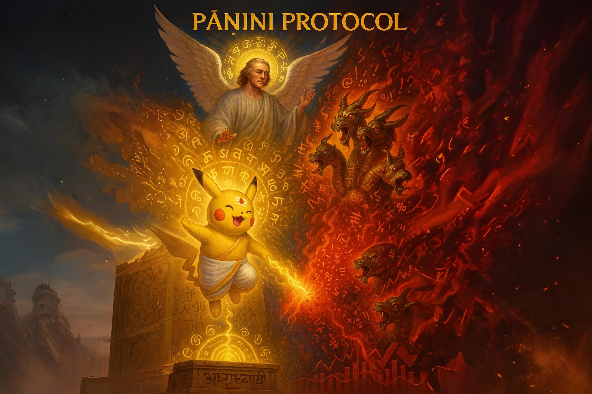
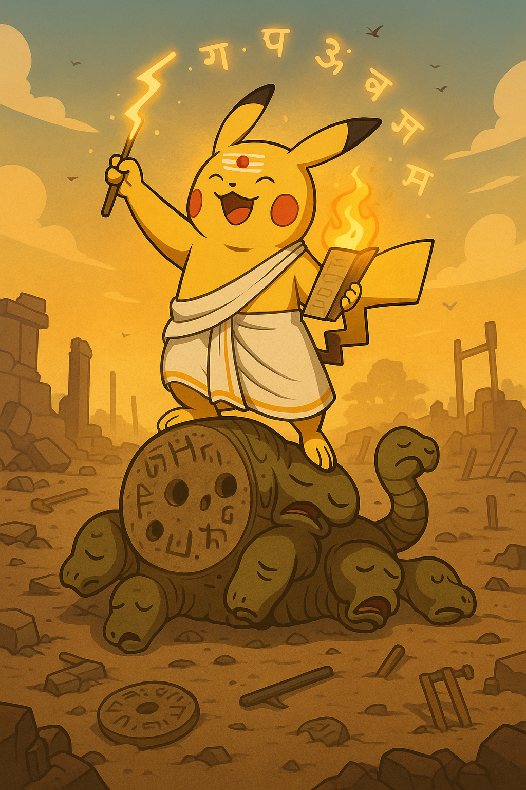

<!-- MathJax for rendering inline/block LaTeX -->

# Pāṇini Protocol

Welcome to the official dashboard for the first decipherment of the United States constitution as Pāṇinian Sanskrit!

 

## TL;DR

- [Yajnadevam](https://x.com/yajnadevam) claims to have deciphered the Indus script as Sanskrit using cryptographic methods
- The resulting "Sanskrit" is ungrammatical and nonsensical
  - Anything can be force-fitted and read as fake "Sanskrit" by torturing obscure grammar rules
- When these flaws were privately pointed out, Yajnadevam dismissed them and challenged us to "decipher" the U.S. Constitution as "Sanskrit"
- We successfully "deciphered" the U.S. Constitution as "Sanskrit", demonstrating that his method is flawed

This site documents that demonstration, Yajnadevam's response (rather, lack thereof), and *why* the method fails.

# Start Here: Contents of the Protocol
- [Background: Who is Yajnadevam and What Did He Claim?](#background---who-is-yajnadevam-and-what-did-he-claim)
  - [How the US Constitution Challenge Came About](#how-the-challenge-came-about)
  - [What Counts as a Decipherment?](#what-counts-as-a-decipherment)
    - [The Unicity Distance Turned Out to be Conveniently Flexible](unicity-history.md)
    - [The Definition of the Challenge Entered Competitive Acrobatics](dancing-goalposts.md)
- [Our Solution to the Challenge (Jefferson's Key)](#our-solution-to-the-challenge-jeffersons-key)
  - [Translations](#translations)
    - [Decipherment of the US Constitution](translation.md)
    - [Decipherment of Arbitrary Short Words](short-words.md)
    - [Decipherment of Nietzche's German](https://x.com/Ugrashravas/status/1943143128032309745)
- [Why is Yajnadevam's Math Wrong?](#but-why-is-yajnadevams-math-wrong)
- [Present Status (NEW: We've been blocked!)](#present-status)

# Background - Who is Yajnadevam and What Did He Claim?

Yajnadevam ([@yajnadevam](https://x.com/yajnadevam)) has made waves online and in media by claiming to have deciphered the Indus Valley Civilization (IVC) script using cryptography and information theory. He presents the output as "Sanskrit" and asserts that it is "mathematically correct".

However, Yajnadevam’s proposed readings, in "Sanskrit", violate basic grammar rules. The issues are so fundamental that even beginner-level students of Sanskrit can recognize them as artificial and incorrect. Multiple scholars and enthusiasts have pointed this out, but Yajnadevam deflects by citing obscure Vedic usages and far-fetched interpretations of Pāṇini's Aṣṭādhyāyī stretched beyond reasonable bounds.

The truth is that, by torturing Pāṇini’s rules in this way, *anything* can be made to look like "Sanskrit."

## How the Challenge Came About

Over long private exchanges, I pointed out these deficiencies and even showed how his method could be meaningfully adapted if the goal were actually to decipher a text written in proper Sanskrit.

However, Yajnadevam refused to acknowledge any flaw. Instead, he issued a challenge: if my critique is valid, then I should be able to “decipher” *even the U.S. Constitution* as "Sanskrit" using his methods.

 

... and, that’s exactly what I’ve done.

This site isn’t just a rebuttal. It’s a demonstration of how methodological abuse can produce false “decipherments,” and how mathematical jargon can be used to dazzle rather than to clarify.

## What Counts as a Decipherment?

What exactly counts as *deciphering* the U.S. Constitution? For the purposes of this demonstration, we adopt the **same metric** that Yajnadevam uses to claim validity for his IVC Script decipherment: **unicity distance**.

From his own website:

> **"How do we know this is all correct?**  
> The correctness of the decipherment is judged simply by being able to read the corpus beyond the unicity distance. Even if all sign values were derived in a dream, thats the only thing that matters."  
> — [Yajnadevam / ScriptDerivation](https://github.com/yajnadevam/ScriptDerivation)

So, by his own criterion, our task is simple: **cross the unicity distance**, and the decipherment is "valid." (**Note:** As we have [explained here](methodology-flaws.md), Unicity Distance is not a metric for correctness. i.e., Yajnadevam's claim to correctness is flawed at the outset.)

Nevertheless, even after we had played by Yajnadevam's own rules,
1. The [**Definition of the Challenge Entered Competitive Acrobatics**](dancing-goalposts.md) immediately, and we were asked to "prove" all sorts of irrelevant things to avoid addressing the central point, Unicity Distance.

2. In the rare instance that the Unicity Distance was addressed, [**It Turned Out to be Conveniently Flexible**](unicity-history.md) and kept changing as more of the Constitution was deciphered. No final value has been settled on by Yajnadevam till date.

# Our Solution to the Challenge ("Jefferson's Key")

Now, to begin our "decipherment" of the U.S. Constitution, we require a mapping from **Latin letters to Sanskrit phonemes**.  Luckily, such a key was revealed by Thomas Jefferson in a dream to Ugraśravas:

 

<!-- 
<table border="0" cellpadding="6" cellspacing="0" class="center">
  <thead>
    <tr>
      <th>Latin Symbol</th>
      <th>Sanskrit Phoneme Class</th>
    </tr>
  </thead>
  <tbody>
    <tr><td>E</td><td>अ, आ</td></tr>
    <tr><td>T</td><td>श, ष, स, ह</td></tr>
    <tr><td>A</td><td>त, थ, ट, ठ</td></tr>
    <tr><td>O</td><td>इ, ई, य्</td></tr>
    <tr><td>I, J</td><td>न</td></tr>
    <tr><td>N</td><td>र, ऋ, ॠ</td></tr>
    <tr><td>S, Z</td><td>व</td></tr>
    <tr><td>H, X</td><td>म</td></tr>
    <tr><td>R</td><td>य</td></tr>
    <tr><td>D</td><td>द, ध, ड, ढ</td></tr>
    <tr><td>L</td><td>ए, ऐ, अय्</td></tr>
    <tr><td>U</td><td>उ, ऊ, व्</td></tr>
    <tr><td>C</td><td>प, फ</td></tr>
    <tr><td>M</td><td>क, ख</td></tr>
    <tr><td>W</td><td>ओ, औ, अव्</td></tr>
    <tr><td>F</td><td>ब, भ</td></tr>
    <tr><td>G, Q</td><td>च, छ</td></tr>
    <tr><td>Y</td><td>अस्, अः</td></tr>
    <tr><td>P</td><td>अन्, अं, ङ्, ञ्</td></tr>
    <tr><td>B</td><td>ग, घ</td></tr>
    <tr><td>V</td><td>ज, झ</td></tr>
    <tr><td>K</td><td>ल, ऌ</td></tr>
  </tbody>
</table>
-->
## Latin to Sanskrit Phoneme Class Mapping

 

**NOTE 1:**  This mapping is exactly as valid as Yajnadevam's, since, by his own standards, origin doesn't matter as long as the unicity threshold is crossed.

**NOTE 2:** the phoneme classes in this table are nearly replicas of Yajnadevam's own, with very few modifications.

**NOTE 3:** The scheme used to read the constitution using this table is much stricter and more conservative than Yajnadevam's, as we do not aribtrarily double consonants or arbitrarily insert *visarga*s and *anusvāra*s.

## Translations

The decipherment and translation of the [United States constitution are available here](translation.md).

Once this was complete, we were challenged to decipher arbitrary short words. The decipherment and translation of these [short English words are available here](short-words.md).

Additionally, we have also [deciphered Twitter brainrot](https://x.com/Ugrashravas/status/1942632943312146555) and [Nietzche's "Also sprach Zarathustra" from the original German](https://x.com/Ugrashravas/status/1943143128032309745) beyond the (original) unicity distance.

# But Why is Yajnadevam's Math Wrong?

*[See here for the main explanation](methodology-flaws.md)*

This is a very pertinent question. It reminds us of one of our favorite "proofs" from high school:

$$
x^2 = x \cdot x = \underbrace{x + x + x + \cdots + x}_{x \text{ times}} \quad \text{(multiplication as repeated addition)}
$$

Take the derivative on both sides:

$$
\frac{d}{dx}(x^2) = \frac{d}{dx}(\underbrace{x + x + \cdots + x}_{x \text{ times}})
$$

Apply the sum rule:

$$
2x = \underbrace{1 + 1 + \cdots + 1}_{x \text{ times}} = x
$$

$$
2x = x
$$

So, when $$x \neq 0$$

$$
\therefore 2 = 1
$$

If this is shown even to students of the first grade, most of them will point out that the final result is obviously wrong. Yet they may struggle to explain why, as they don't understand concepts like functions, limits, or derivatives. Even beginner students of calculus often miss the flaw at first glance if the presentation is slick; And they are even more likely to do so if the erroneous conclusion is hidden.

A similar kind of mistake is happening here, with an extra layer of *double blindness*:

- Even beginner students of Sanskrit can easily tell that Yajnadevam's results are wrong. But they usually lack the tools of information theory to explain *why* the method fails.

- On the other hand, those trained in information theory usually have no knowledge of Sanskrit. They see the math but don't have the tools to judge the linguistic absurdity of the output.

In fact, just like novice calculus students with the $$2 = 1$$ "proof", even professors of information theory may overlook the flaws in the method if it’s presented smoothly, unless they are shown the blatantly false final result. And this is exactly what happens: during his [presentations at various institutes](https://x.com/yajnadevam/status/1865947711880757272), Yajnadevam focuses only on the method, rarely (if ever) revealing the final linguistic outputs. This makes him claim that his method has been endorsed by the audience, even when its conclusions were hidden from and/or incomprehensible to them.

We have however begun reviewing the math in detail and have noted some [fundamental flaws in Yajnadevam's methods](methodology-flaws.md). As noted in the page, there are still some intellectually interesting loose ends (albeit irrelevant to the problem), such as the redundancy of Pāṇinian torture. If time permits, we might compute and tie these loose ends together in the (far) future.

# Present Status

Eventually, rather than respond to any of the arguments, [Yajnadevam chose to block us](https://x.com/Ugrashravas/status/1950604010765099145) — presumably to avoid further problematic questionss.

This remains the only definitive action he has taken in response to the demonstration.

 

<blockquote class="twitter-tweet">
Absolute W  Case closed folks, <a href="https://twitter.com/yajnadevam?ref_src=twsrc%5Etfw">@yajnadevam</a> has no further responses<a href="https://t.co/wNBMD4946m">https://t.co/wNBMD4946m</a> might undergo some final aesthetic updates &amp; perhaps include a more detailed chronological curation of this run from start to end <a href="https://t.co/BGxuBBgAU9">pic.twitter.com/BGxuBBgAU9</a>
&mdash; उ॒ग्रश्र॑वस् (@Ugrashravas) <a href="https://twitter.com/Ugrashravas/status/1950604010765099145?ref_src=twsrc%5Etfw">July 30, 2025</a></blockquote>  

## Unicity Distance Live Update

Although we had deciphered the US constitution beyond unicity distance using the same formula Yajnadevam has used in his draft, we didn't expect him to simply concede; We anticipated he would start adjusting and negotiating the unicity distance upward. In that spirit, we've visualized the history of UD values: earlier ones are shown in pink, while the most recent value provided by Yajnadevam appears in red. ~~For now, the red marker stands alone, but we're not betting it'll stay that way~~.

As predicted, the red marker has moved **2** times as of date. The history of these changes is recorded [here](unicity-history.md).

As of date, the unicity distance is **475**, and **508+** symbols have been translated (green bar). This may be outdated — see the [translation page](translation.md) for live numbers.

<h3>Progress in first 1000 symbols</h3>

  <!-- Green progress bar -->
  

  <!-- Unicity Distance marker -->
  

  

  <!-- Unicity Distance marker -->
  

  

  <!-- Unicity Distance marker -->
  

  

Current progress: <strong>50.80%</strong>. Last updated: 2025-Jul-14, 21:49 (GMT +5:30)
