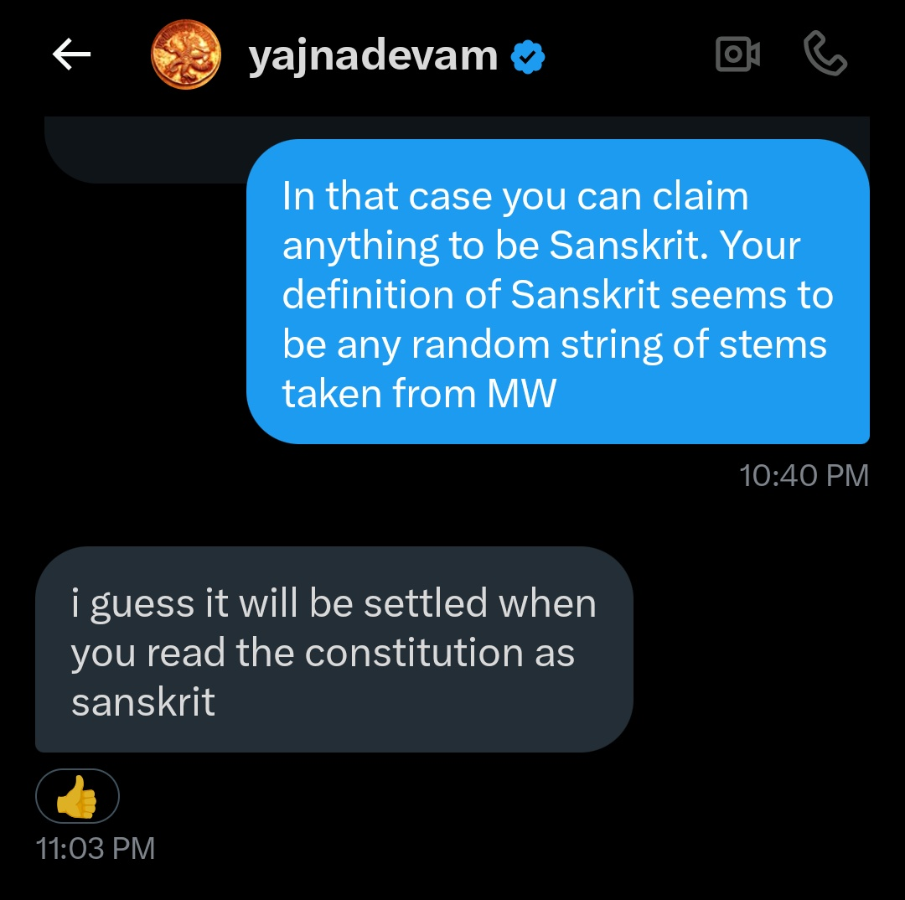
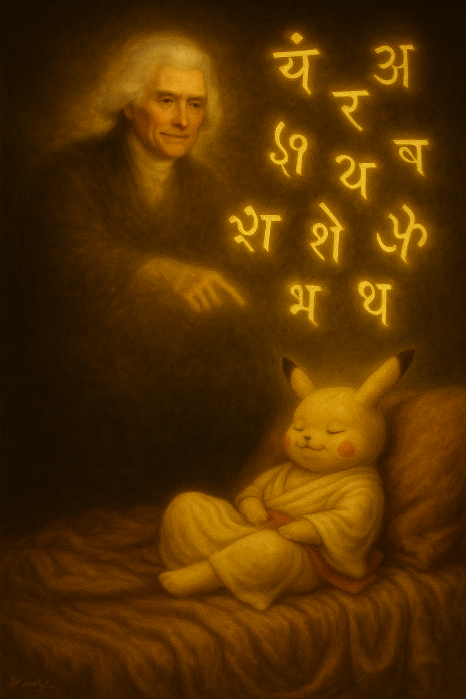
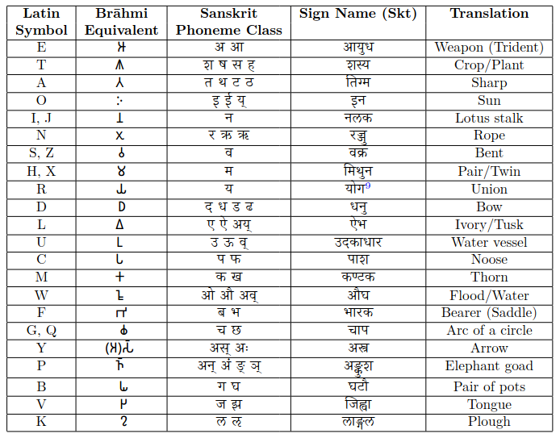

<!-- MathJax for rendering inline/block LaTeX -->

# Pāṇini Protocol

Welcome to the official dashboard for the first decipherment of the United States constitution as Pāṇinian Sanskrit!

 

# Background

Yajnadevam ([@yajnadevam](https://x.com/yajnadevam)) has made waves online and in media by claiming to have deciphered the Indus Valley Civilization (IVC) script, a problem that has stumped linguists, epigraphers, and historians for over a century. Unlike traditional approaches rooted in archaeology and linguistics, Yajnadevam claims his method is based on cryptography and information theory, and therefore, "mathematically correct".

However, Yajnadevam’s proposed readings, supposedly in Sanskrit, are riddled with ungrammatical constructions, violating basic rules of Sanskrit grammar. The issues are so fundamental that even beginner-level students of Sanskrit can recognize them as artificial and incorrect. Multiple scholars and enthusiasts have pointed this out, yet he continues to assert the correctness of his "Sanskrit" by citing obscure Vedic usages and far-fetched interpretations of Pāṇini's Aṣṭādhyāyī stretched beyond reasonable bounds.

The truth is simply that, by torturing Pāṇini’s rules in this way, *anything* can be made to look like "Sanskrit." During our long exchanges, I laid out these deficiencies clearly, and even offered constructive suggestions: I showed how his own set-intersection method could be meaningfully adapted, if the goal were actually to decipher a text written in proper Sanskrit.

However, Yajnadevam refused to acknowledge any flaw. In fact, he issued a challenge: if my critique is valid, then I should be able to “decipher” *even the U.S. Constitution* as Sanskrit using his methods.

 

... and, that’s exactly what I’ve done.

This isn’t just a rebuttal. It’s a demonstration of how methodological abuse can produce false “decipherments,” and how mathematical jargon can be used to dazzle rather than to clarify.

## Statement of the Challenge

What counts as *deciphering* the U.S. Constitution? For the purposes of this demonstration, we shall adopt the **same metric** that Yajnadevam uses to claim that his Indus Valley Civilization (IVC) decipherment is valid: **unicity distance**.

From his own website:

> **"How do we know this is all correct?**  
> The correctness of the decipherment is judged simply by being able to read the corpus beyond the unicity distance. Even if all sign values were derived in a dream, thats the only thing that matters."  
> — [Yajnadevam / ScriptDerivation](https://github.com/yajnadevam/ScriptDerivation)

Thus, to demonstrate a successful “decipherment” of the U.S. Constitution, we must simply **cross this unicity distance** — by Yajnadevam’s own criterion.

### The Highly Flexible and Convenient Nature of the Unicity Distance
Now, the unicity distance proposed by YD keeps changing as more and more symbols of the constitution are deciphered. The history of these formulae for calculating unicity distance has therefore been shifted to [its own page](unicity-history.md).

We shall soon also include a page explaining what unicity distance actually is, in a comprehensible way without dazzling the audience with jargon. However, for the moment, please bear with us as we provide only the formulae without a clear definition of the concept.

### The Challenge Definition Has Entered Competitive Acrobatics

While the original challenge is what is described here, the definitions turned out to be more suggestions than rules. What followed was a remarkable display of post-hoc edits, mid-air redefinitions, and increasingly creative pivots.

Enjoy the highlights of the goalpost acrobatics [here](dancing-goalposts.md)!

## Latin to Sanskrit Phoneme Class Mapping (Jefferson's Key)

Now, to begin our "decipherment" of the U.S. Constitution, we require a mapping from **Latin letters to Sanskrit phonemes**.  Luckily, such a key was revealed by Thomas Jefferson in a dream to Ugraśravas:

 

<!-- 
<table border="0" cellpadding="6" cellspacing="0" class="center">
  <thead>
    <tr>
      <th>Latin Symbol</th>
      <th>Sanskrit Phoneme Class</th>
    </tr>
  </thead>
  <tbody>
    <tr><td>E</td><td>अ, आ</td></tr>
    <tr><td>T</td><td>श, ष, स, ह</td></tr>
    <tr><td>A</td><td>त, थ, ट, ठ</td></tr>
    <tr><td>O</td><td>इ, ई, य्</td></tr>
    <tr><td>I, J</td><td>न</td></tr>
    <tr><td>N</td><td>र, ऋ, ॠ</td></tr>
    <tr><td>S, Z</td><td>व</td></tr>
    <tr><td>H, X</td><td>म</td></tr>
    <tr><td>R</td><td>य</td></tr>
    <tr><td>D</td><td>द, ध, ड, ढ</td></tr>
    <tr><td>L</td><td>ए, ऐ, अय्</td></tr>
    <tr><td>U</td><td>उ, ऊ, व्</td></tr>
    <tr><td>C</td><td>प, फ</td></tr>
    <tr><td>M</td><td>क, ख</td></tr>
    <tr><td>W</td><td>ओ, औ, अव्</td></tr>
    <tr><td>F</td><td>ब, भ</td></tr>
    <tr><td>G, Q</td><td>च, छ</td></tr>
    <tr><td>Y</td><td>अस्, अः</td></tr>
    <tr><td>P</td><td>अन्, अं, ङ्, ञ्</td></tr>
    <tr><td>B</td><td>ग, घ</td></tr>
    <tr><td>V</td><td>ज, झ</td></tr>
    <tr><td>K</td><td>ल, ऌ</td></tr>
  </tbody>
</table>
-->

 

**NOTE 1:**  This mapping is exactly as valid as Yajnadevam's, since, by his own standards, origin doesn't matter as long as the unicity threshold is crossed.

**NOTE 2:** the phoneme classes in this table are nearly replicas of Yajnadevam's own, with very few modifications.

**NOTE 3:** The scheme used to read the constitution using this table is much stricter and more conservative than Yajnadevam's, as we do not aribtrarily double consonants or arbitrarily insert *visarga*s and *anusvāra*s.

## Translations

The decipherment and translation of the [United States constitution are available here](translation.md).

The decipherment and translation of [short English words are available here](short-words.md).

Additionally, we have also deciphered Nietzche's "Also sprach Zarathustra" from the original German beyond the (original) unicity distance. This will be uploaded here in due time.

## But Why is Yajnadevam's Math Wrong?

This is a very pertinent question. It reminds us of one of our favorite "proofs" from high school:

$$
x^2 = x \cdot x = \underbrace{x + x + x + \cdots + x}_{x \text{ times}} \quad \text{(multiplication as repeated addition)}
$$

Take the derivative on both sides:

$$
\frac{d}{dx}(x^2) = \frac{d}{dx}(\underbrace{x + x + \cdots + x}_{x \text{ times}})
$$

Apply the sum rule:

$$
2x = \underbrace{1 + 1 + \cdots + 1}_{x \text{ times}} = x
$$

$$
2x = x
$$

So, when $$x \neq 0$$

$$
\therefore 2 = 1
$$

If this is shown even to students of the first grade, most of them will point out that the final result is obviously wrong. Yet they may struggle to explain why, as they don't understand concepts like functions, limits, or derivatives. Even beginner students of calculus often miss the flaw at first glance if the presentation is slick; And they are even more likely to do so if the erroneous conclusion is hidden.

A similar kind of mistake is happening here, with an extra layer of *double blindness*:

- Even beginner students of Sanskrit can easily tell that Yajnadevam's results are wrong. But they usually lack the tools of information theory to explain *why* the method fails.

- On the other hand, those trained in information theory usually have no knowledge of Sanskrit. They see the math but don't have the tools to judge the linguistic absurdity of the output.

In fact, just like novice calculus students with the $2 = 1$ "proof", even professors of information theory may overlook the flaws in the method if it’s presented smoothly, unless they are shown the blatantly false final result. And this is exactly what happens: during his [presentations at various institutes](https://x.com/yajnadevam/status/1865947711880757272), Yajnadevam focuses only on the method, rarely (if ever) revealing the final linguistic outputs. This makes him claim that his method has been endorsed by the audience, even when its conclusions were hidden from and/or incomprehensible to them.

We have however begun reviewing the math in detail and have already noted some fundamental flaws in Yajnadevam's methods. However, merely noting the flaws is often not satisfactory for a zealous audience, so we are attempting to formulate the correct mathematical model for this problem. This shall be uploaded here in due time.

## Present Status

Although we have deciphered the US constitution beyond unicity distance using the same formula Yajnadevam has used in his draft, we don't expect him to simply concede; We anticipate he will start adjusting and negotiating the unicity distance upward. In that spirit, we've visualized the history of UD values: earlier ones are shown in pink, while the most recent value provided by Yajnadevam appears in red. F̶o̶r̶ n̶o̶w̶, t̶h̶e̶ r̶e̶d̶ m̶a̶r̶k̶e̶r̶ s̶t̶a̶n̶d̶s̶ a̶l̶o̶n̶e̶, b̶u̶t̶ w̶e̶'r̶e̶ n̶o̶t̶ b̶e̶t̶t̶i̶n̶g̶ i̶t̶'l̶l̶ s̶t̶a̶y̶ t̶h̶a̶t̶ w̶a̶y̶.

As predicted, the red marker has moved **2** times as of date. The history of these changes is recorded [here](unicity-history.md). More interestingly, the challenge itself underwent metamorphosis multiple times over, and this history is recorded [here](dancing-goalposts.md).

As of date, the unicity distance is **475**, and **508+** symbols have been translated (green bar). This may be outdated — see the [translation page](translation.md) for live numbers.

<h3>Progress in first 1000 symbols</h3>

  <!-- Green progress bar -->
  

  <!-- Unicity Distance marker -->
  

  

  <!-- Unicity Distance marker -->
  

  

  <!-- Unicity Distance marker -->
  

  

Current progress: <strong>50.80%</strong>. Last updated: 2025-Jul-14, 21:49 (GMT +5:30)
