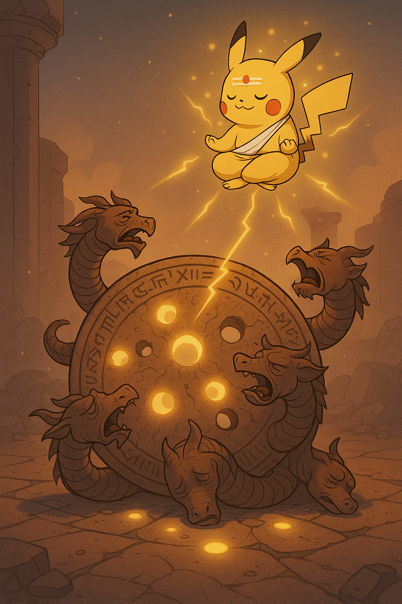
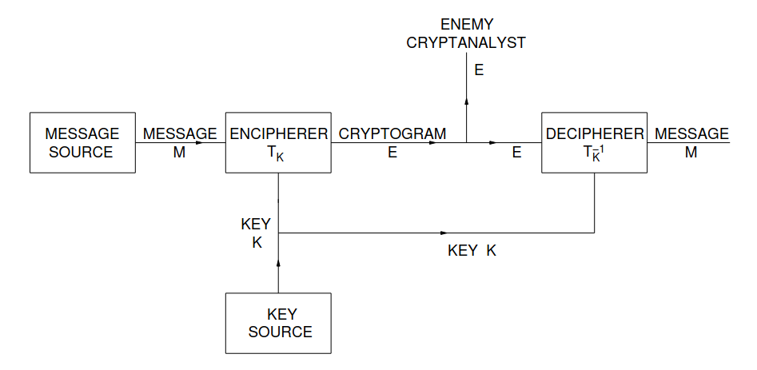

<!-- MathJax for rendering inline/block LaTeX -->

[⬅️ Back to Overview](index.md)

# What is wrong with Yajnadevam's method?

As we've seen, all this gymnastics regarding the decipherment supposedly boils down to this mysterious number called "unicity distance". Let us try to understand, in simple yet precise terms, what this actually is, and how relevant it is to Yajnadevam's claim to correctness. This explanation is essentially a rephrasing of the content available [here](https://cacr.uwaterloo.ca/hac/about/chap7.pdf) and [here](https://www.andrew.cmu.edu/course/18-330/2025s/reading/shannon1949.pdf), more tailored to our present context and geared at a more general audience. We aim to provide a clear and mathematical treatment laying bare all the holes in his method, yet without assuming much of a mathematical background.

## Motivation / Intuition

If you have made it this far, you probably have this intuitive understanding --- When we are deciphering an encoded message by randomly guessing what each symbol of the code stands for, as we decipher more symbols of that code using our key, we get more confident that our key is correct. Intuitively, there must be some *threshold* for the number of symbols we are able to decipher, which if we cross, we can be reasonably sure of the correctness of our key.

The unicity distance is a mathematical heuristic introduced by Claude Shannon to quantify this *threshold*. A formula for unicity distance was provided by him based on a specific set of assumptions regarding the cryptogram problem. It is worth noting that formulae for unicity distance are *heuristic measures*, rather than watertight theoretical formulations, as Shannon himself justified his formula by comparing its predictions with empirical data. Nevertheless, there are ways to compute *useful* if not 100% watertight unicity distances for most cryptogram problems.

The original assumptions considered by Shannon, which is what Yajnadevam claims to have used, comprise the *Shannon Theory of Secrecy*. As we shall see, Yajnadevam's approach does not obey these assumptions. While this is not a problem in itself, it means that a modified formulation is required to define and compute a "unicity distance" for his case. Regardless, we shall also see that Yajnadevam's claim to correctness based on unicity distance is also flawed, because of what it actually measures. In short, unicity distance is an indicator of "equivocation", not "correctness" (elaborated [later](#what-does-yajnadevams-decipherment-crossing-the-unicity-distance-prove)).

## The Shannon Theory of Secrecy

A cipher/cryptogram is a way to "encode" a message. That is, it turns a message ("plaintext") into an encoded form ("ciphertext").

*Schematic of a general secrecy system, [Shannon 1949](https://www.andrew.cmu.edu/course/18-330/2025s/reading/shannon1949.pdf)*

### The "Message" / Plaintext
We think of the message (plaintext) as a sequence of $$n$$ discrete symbols. These symbols may be letters of a language, words of a language, or even sound levels of an audio signal (as long as these sound levels have been "quantized", i.e., made discrete!).

Now, a language can be modelled as a process that randomly generates sequences of these symbols. However, the strings a language generates aren't completely chaotic. Mathematically, every symbol occurs with a certain definite probability
<!-- (In fact, these probabilities can even be dependent on each other: For example, if we are blind to context, the probability of the English language randomly generating the symbol 'U' is $$<3\%$$; But if the language happened to have randomly generated 'Q', the probability of the next letter being 'U' is nearly $$100\%$$). -->
For Sanskrit, we can assume the discrete set of symbols constituting the plaintext to be the 63 *varṇa*s described in the *śikṣā* texts, minus ones that occur completely deterministically (the 4 *yama*s, *jihvāmūlīya*, and *upadhmānīya*) and ones that don't occur in regular classical language (the 9 *pluta* vowels): resulting in *48 unique phonemes* that can occur in a random sequence in a "Sanskrit sentence".

This is the frequency distribution, and hence, the *apriori* expected probabilities of individual symbols $$X_i$$ of plaintext.

| S.No | $$x$$ | $$P(X_i=x)$$ | S.No | $$x$$ | $$P(X_i=x)$$ | S.No | $$x$$ | $$P(X_i=x)$$ |
|-------|------|----------|-------|------|----------|-------|------|----------|
| 1     | अ    | 0.1978    | 17    | ख्   | 0.013     | 33    | द्   | 0.285     |
| 2     | आ    | 0.819     | 18    | ग्   | 0.082     | 34    | ध्   | 0.083     |
| 3     | इ    | 0.485     | 19    | घ्   | 0.015     | 35    | न्   | 0.481     |
| 4     | ई    | 0.119     | 20    | ङ्   | 0.063     | 36    | प्   | 0.246     |
| 5     | उ    | 0.261     | 21    | च्   | 0.126     | 37    | फ्   | 0.003     |
| 6     | ऊ    | 0.073     | 22    | छ्   | 0.017     | 38    | ब्   | 0.046     |
| 7     | ऋ    | 0.074     | 23    | ज्   | 0.094     | 39    | भ्   | 0.127     |
| 8     | ॠ    | 0.001     | 24    | झ्   | 0.001     | 40    | म्   | 0.434     |
| 9     | ऌ    | 0.001     | 25    | ञ्   | 0.035     | 41    | य्   | 0.425     |
| 10    | ए    | 0.284     | 26    | ट्   | 0.026     | 42    | र्   | 0.505     |
| 11    | ऐ    | 0.051     | 27    | ठ्   | 0.006     | 43    | ल्   | 0.069     |
| 12    | ओ    | 0.188     | 28    | ड्   | 0.021     | 44    | व्   | 0.499     |
| 13    | औ    | 0.018     | 29    | ढ्   | 0.003     | 45    | श्   | 0.157     |
| 14    | ं    | 0.022     | 30    | ण्   | 0.103     | 46    | ष्   | 0.145     |
| 15    | ः    | 0.131     | 31    | त्   | 0.665     | 47    | स्   | 0.356     |
| 16    | क्   | 0.199     | 32    | थ्   | 0.058     | 48    | ह्   | 0.107     |

Of course, we've shown the table as if each $$X_i$$ could independently take these values with the listed probabilities, but keep in mind that the probability table for each $$X_i$$ will depend on all other letters $$\{X_1,X_2,...,X_{i-1},X_{i+1},...X_n\}$$. But this is a good starting point.

Using such probabilities of occurence of these phonemes, we define the **message** as a **string of random variables $$\{X_1X_2...X_n\}$$** where each $$X_i$$ takes a value $$x$$ from this set of 48 symbols.

<!-- Now, the entropy $$H$$ of a random variable $$X$$ is defined as

$$H(X) = -\sum_x P(X=x) \log_2{P(X=x)}$$

For a random phoneme of Sanskrit, this works out to be $$\approx4.51$$ bits 

Hence, $$H(X_1X_2...X_n) \geq 4.51$$ bits -->

### The "Code" / Ciphertext

The ciphertext is also a sequence of symbols, each of which belongs to a discrete set of possible symbols. The symbols of the ciphertext also follow a certain probability distribution.

In our case, the ciphertexts are the inscriptions in the Indus Valley seals. The discrete set of all possible ciphertext symbols are the set of $$\approx417$$ glyphs identified by Mahadevan.

### The "Key"

There exist many transformations from the plaintext space to the ciphertext space:

$$E=T_iM$$

Now, in order to decrypt the ciphertext $$E$$ and retrive the message $$M$$ using the key, this transformation must be reverisble:

$$M=T_i^{-1}E$$

Each of these **reversible transformations** $$T_i$$'s is called a "key". The remaining theory that Shannon develops is built on this fundamental assumption.

Clearly, in Yajnadevam's case, the transformations are not reversible. In fact, neither encryption nor decryption is unique using his key: the same message $$M$$ can be encoded as many different cryptograms $$E$$, and the same cryptogram $$E$$ can be deciphered as many different messages $$M$$. In other words, the "multiple readings" possible through Yajnadevam's key are **not** due to [puns](https://x.com/yajnadevam/status/1622280340520714243) or [other semantic considerations](https://x.com/yajnadevam/status/1882500030478860401) as he claims; They are due to the *key itself being non-reversible*.
<!-- https://x.com/yajnadevam/status/1882459577297604766 -->
***Shannon's formulation is not applicable*** to [many to many](https://indusscript.net/allographs) keys, as such keys are unable to produce a unique plaintext from a given ciphertext: $$T_i^{-1}$$ simply does not exist.

### Shannon's "Unicity Distance"

As Shannon's original formulation cannot be applied to compute the unicity distance in this case, this problem needs to be modelled differently, expanding on his work. But before that, let us review what Shannon meant by "unicity distance" under his original formulation with uniquely reversible keys.

Suppose we are able to obtain $$N$$ symbols of [ciphertext](#the-code--ciphertext). Suppose further that ***we know*** **[!!1]** there are $$K$$ different possible one to one mappings $$T_i$$ between ciphertext and plaintext (["keys" or "transformations"](#the-key)). Then, we can apply the inverse mapping $$T_i^{-1}$$ to all $$N$$ symbols of ciphertext to obtain $$N$$ symbols of plaintext. This will give us $$K$$ different sequences of length-$$N$$ plaintext (one for each mapping $$T_i$$).

Now, not all these $$K$$ different sequences of plaintext will be ***"correct"*** **[!!2]**. That is, a lot of these keys will produce gibberish sequences of plaintext symbols, and only some will produce sequences that can possibly be "correct" plaintext.

#### An Illustration with an English Cipher

For example, suppose we recover an English ciphertext "SGX", and we ***know*** **[!!1]** that it is a simple substitution cipher. Then, we
can calculate the number of all possible keys as $$26!$$ (if you are confused by the [exclamation point after 26](https://en.wikipedia.org/wiki/Factorial), think of $$26!$$ as a shorthand for denoting the number of ways in which $$26$$ different objects can be arranged in a row. This is a huge number). Now, *because we* ***assumed*** the key to be a simple substitution mapping **[!!1]** and the message encoded to be English **[!!2]**, we know that:
- The plaintext must have 3 symbols
- The 3 symbols of plaintext must be unique, and,
- The plaintext must occur in the English dictionary **[!!2]**

So, let's say there are [around 1200](https://www.quora.com/How-many-3-letter-words-exist-in-English) different three letter words in the English dictionary with all three letters distinct. Each of these words gives us some possible keys: more specifically, if we consider the word "cat", we get the key (mappings shown from $$CIPHERTEXT\rightarrow plaintext$$):

$$
\{...,G\rightarrow a, S\rightarrow c,X\rightarrow t,...\}
$$ 

We still cannot decide on any mappings for the other 23 letters, which can randomly be mapepd in $$23!$$ possible ways. So, using the word "cat", we have narrowed down from $$26!$$ to $$23!$$ possible keys. But "cat" isn't the only possible three letter word in English, there are 1200. So, using the ciphertext "SGX" along with our two key assumptions:
1. That the key is a simple substitution cipher **[!!1]**, and,
2. That the plaintext corresponding to the ciphertext appears in the English dictionary **[!!2]**,

we have reduced the number of possible keys from $$26!$$ to $$1200\cdot 23!$$. Now, as we keep repeating this with more and more symbols of the ciphertext, the number of ***"plausible"*** **[!!2]** keys keeps reducing. Eventually, we reach a stage where only one key is able to decipher a cryptogram.

---
 
***This length of the ciphertext*** at which only one key among the ***set of keys we have assumed to be possible*** **[!!1]** produces a ***correct reading of the plaintext*** **[!!2]** is what Shannon calls the ***Unicity Distance***

---

Phew! Of course, this still applies only to invertible keys, which yajnadevam's isn't. Nevertheless, it must already be clear by now that contrary to Yajnadevam's claims, the Unicity Distance **cannot prove correctness** in terms of either:

1. Eliminating other possible writing systems for the IVC corpus such as true alphabets, abugidas, abjads, or even syllabaries, **[!!1]** or most importantly,
2. Showing that the provided sign values read grammatically correct Sanskrit **[!!2]**

Rather, these are both **non-mathematical** assumptions that have to be verified using ***external tools not provided by information theory*** (and not just *Shannon's formulation of information theory*, but information theory itself in its  most general form)---The foundations based on which the rest of the information theory formulation is constructed!

---
 
Therefore, this entire challenge about reading the constitution as Sanskrit is merely a deflection from crticism on point **[!!2]**. The idea is to show that if the US constitution can be "deciphered as Sanskrit" using the spurious forms that Yajnadevam has employed and also pass the (naturally faulty) mathematical jugglery resulting from this fundamentally flawed treatment of "Sanskrit correctness", it would hopefully convince non-Sanskrit speakers that the "Sanskrit" used by Yajnadevam is not really Sanskrit---Because, hopefully, they accept that the US constitution is an English text and are able to appreciate the absurdity of it being readable as grammatically correct Sanskrit.

---
 

#### The Two *Key* Limitations Elaborated *(Pun Unintended)*

Over the past few paragraphs, we have included two little screaming boxes **[!!1]** and **[!!2]** wherever we made or deduced something from a critical, ***non-mathematical*** assumption. The reason is that, **any mathematical object** - redundancy, keyspace, unicity distance, etc., - is fundamentally tied to these assumptions, and meaningless if either of these assumptions is wrong. The results from the subsequent mathematics **cannot reverse-prove** these assumptions.

It is these assumptions that define and limit the search-space for our problem---The mathematics simply gives us metrics to work with *within* this search space. Hence, these assumptions must be as general as possible at the outset. Let us illustrate this, again with our "SGX" example.

##### The Keyspace is Infinite for the Indus Corpus

First, let us examine our assumption that the key used was a simple substitution mapping **[!!1]**. There are many other different kinds of ciphers, famously including the enigma, where the mapping from ciphertext to plaintext changes for every letter that's being encoded/decoded. In this case, the keyspace would be much higher than $$26!$$ (which is why the British had a hard time cracking it!). We would hence have to include many more dictionary words while calculating the reduced keyspace, such as "all", "inn", "too", etc---We had previously not considered these words since the substitution mapping did not allow the plaintext to have repeated letters. Without any knowledge of the key, **assuming it** to be a substitution one does not automatically reduce our search-space, and will result in a **false unicity distance**.

Now, Yajnadevam would argue that his decipherment has yielded **"correct"** **[!!2]** readings using the mapping he has employed, and that alone is sufficient to vindicate his mapping. This leads us to the next assumption - What *is* a "correct" reading of the plaintext?

Let's review our second assumption that any sequence of plaintext strings decoded from the ciphertext must appear in the English dictionary **[!!2]**. Given a random ciphertext "SGX" without any further information, this is not a requirement even if we assume a substitution cipher - "SGX" could encode German (weg) or Sanskrit (saḥ). In fact, it is not a requirement even if we assume the language of plaintext to be English: the plaintext here could be "his" or "its", neither of which occur in English dictionaries (instead, we would find them in their base forms "he" and "it").

This problem is infinitely worse in Sanskrit, which is a heavily conjugated language, and usage of conjugated forms is grammatically forbidden. To illustrate, a typical Sanskrit sentence would be:

``हनुमान् वने गच्छति (Āñjaneya goes into the forest)``

While in the dictionary, these words would be listed as

``{हनुमत् =Āñjaneya, वन =forest, गम् =to go}``

The word forms in the _sentence_ are derived through [regular rules](https://ashtadhyayi.com), and a large number of such forms is possible (making it unwieldy to include all of them in dictionaries, which is why only the base/stem form is indicated). Interestingly, there is an explicit grammatical rule in Sanskrit ([अपदं न प्रयुञ्जीत](https://ashtadhyayi.com/sutraani/sk29)) forbidding in speech or writing the usage of forms listed in the dictionaries. In other words, even if we come across a ciphertext that we **know** is Sanskrit, we **know** that the plaintext reading ***cannot possibly be*** ``हनुमत्`` or ``वन`` or ``गम्``. Instead, we must use a list of fully conjugated nouns (सुबन्तs) and verbs (तिङन्तs) while searching for words occuring in plaintext. Ideally, we must also account for inter-word *sandhi*s.

Yajnadevam, however, creates his search-space from the Monier Williams dictionary, which as explained before, is a dictionary and contains only base forms that are forbidden from being *used* in Sanskrit. That is, the language that he is trying to decipher the Indus corpus as is *not Sanskrit* from the get-go. It is not possible for him to "decipher" any ciphertext ***"correctly"*** **[!!2]** as Sanskrit, since the list of strings he is comparing his plaintexts with does not contain any Sanskrit strings. This is apparent from his "decipherments", which read like random stems and roots from the dictionary joined arbitrarily, and has been rejected by Sanskrit scholars unanimously.

### What does this mean for Redundancy?

We've often seen Sanskrit speakers look at Yajnadevam's decipherments and say "Pāṇini can be made to read anything this way!". The typical counter this is met with is that the redundancy of Pāṇinian rules (recently conceded by Yajnadevam to be different from Sanskrit) is not 0. While nobody has attempted to calculate any such metric related to redundancy for the type of string-mashing employed by Yajnadevam, for purely theoretical purposes, it is worth clarifying whether "Pāṇini can be made to read anything this way!" indeed translates to "Pāṇinian rules having a redundancy of 0".

When Sanskrit speakers say Pāṇini can be made to read anything, they mean that *if a kind of cipher is chosen intelligently* **[!!1]**, then there exists *atleast one assignment* of Sanskrit phonemes to it, using which the corpus can be read as a tortured form of "Sanskrit" (it still does not mean that they admit any of these readings are correct Sanskrit **[!!2]** --- they are simply using the same incorrect definition as Yajnadevam for "Sanskrit"/"Pāṇinian rules" when he uses such terms to describe his concatenations of non-word strings). It is possible for there to exist *multiple assignments* of Sanskrit phonemes to the ciphertext symbols that still produce such non-word strings (termed "Sanskrit"/"Pāṇinian rules" by Yajnadevam) from a ciphertext of length $$N$$---In this case, the unicity distance will be very large. This does NOT mean that:
1. Either of the assignments *fail* to render the ciphertext as non-word-strings, or that,
2. Both assignments render it into *correct Sanskrit*.

Being unable to cross the unicity distance simply means that the text can be tortured in **many other ways**.

In conclusion, *even **IF*** the redundancy of "Pāṇinian rules" turns out to be comparable to the $$0.7$$ of real languages, Yajnadevam's claim would boil down to claiming that, under the particular types of mappings ***he*** *wants to consider*, **only** his specific assignment can read the Indus corpus as ***strings of non-words***. Thus, even if the redundancy of Pāṇinian torture were non-zero, it does not make this language "Sanskrit". It is even perhaps a sad reflection of Yajnadevam's Sanskrit knowledge (rather, lack thereof) that he is ***only*** able to make ***one*** key read meaningless non-word-strings.

### What does Yajnadevam's "decipherment" crossing the Unicity Distance prove?

To summarize what is outlined above, **if** Yajnadevam's unicity distance happens to be finite, **and** he crosses it, then this is what will be proven:

> **If** one assumes that the Indus Corpus uses the same arbitary & specific kind of orthography as assumed by Yajnadevam, **then**, out of *all the ways* in which Sanskrit phonemes can be assigned to ***this** particular kind of orthography*, his assignment is the *only one* in which *all* the available seals can be read as nonsense strings.

Actually calculating the unicity distance for Yajnadevam's many-to-many keyspace and the redundancy of Monier-Williams-string-mashing, and whether Yajnadevam will succeed in crossing it, is an irrelevant (albeit intellectually stimulating) exercise that we shall take up in a future episode of the Pāṇini Protocol out of sheer curiosity.

[⬅️ Back to Overview](index.md)