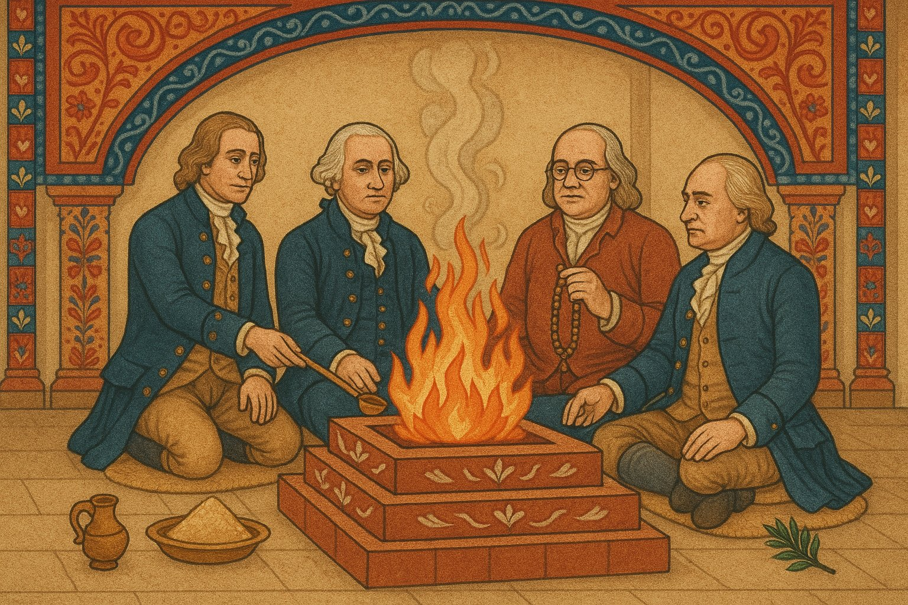

[⬅️ Back to Overview](index.md)
# Translation Table

Below is a breakdown of translated English sentences with their Sanskrit equivalents, parsing, and grammar notes.

 

<h3>Live Translation Table</h3>

<iframe 
  src="https://docs.google.com/spreadsheets/d/e/2PACX-1vQjsWIYOeOO4_I-gm8lDFz9XPbwqW1qwFvakExaYk3WiSFwhMvBTrCtb9znqMgVDdsgdTu-5OZobM4S/pubhtml?gid=0&single=true" 
  width="100%" height="1000">
</iframe>

[⬅️ Back to Overview](index.md)